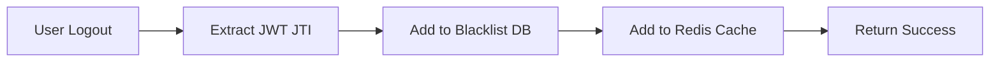
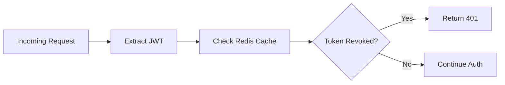

# 🔐 **Plano de Implementação: JWT Blacklist/Revogação**

## 📊 **Visão Geral**

### **Objetivo:**
Implementar sistema completo de blacklist para invalidar tokens JWT antes do tempo de expiração em casos de logout, bloqueio de usuário ou mudança de senha.

### **Problema Atual:**
- Tokens JWT não podem ser invalidados antes da expiração
- Logout não revoga o token (continua válido)
- Usuários bloqueados ainda podem usar tokens ativos
- Mudança de senha não invalida sessões ativas

### **Solução:**
Manter lista de tokens revogados no banco de dados + cache Redis para verificação rápida em cada requisição autenticada.

---

## 🏗️ **Arquitetura da Solução**

### **Fluxo de Revogação:**


### **Fluxo de Verificação:**


---

## 📋 **Componentes Detalhados**

### **1. 🗄️ Entity: RevokedToken**

**Arquivo:** `src/main/java/com/blog/api/entity/RevokedToken.java`

```java
@Entity
@Table(name = "revoked_tokens")
public class RevokedToken {
    
    @Id
    @GeneratedValue(strategy = GenerationType.IDENTITY)
    private Long id;
    
    @Column(name = "token_jti", nullable = false, unique = true, length = 36)
    private String tokenJti; // JWT ID (UUID)
    
    @Column(name = "user_id")
    private Long userId;
    
    @Column(name = "revoked_at", nullable = false)
    private LocalDateTime revokedAt;
    
    @Column(name = "expires_at", nullable = false)
    private LocalDateTime expiresAt;
    
    @Enumerated(EnumType.STRING)
    @Column(name = "reason", length = 20)
    private RevokeReason reason;
    
    public enum RevokeReason {
        LOGOUT,           // Logout normal do usuário
        ADMIN_REVOKE,     // Revogação administrativa
        PASSWORD_CHANGE,  // Mudança de senha
        ACCOUNT_LOCKED,   // Conta bloqueada
        SECURITY_BREACH   // Comprometimento de segurança
    }
    
    // Constructors, getters, setters...
}
```

**Índices para Performance:**
```sql
CREATE INDEX idx_revoked_tokens_jti ON revoked_tokens(token_jti);
CREATE INDEX idx_revoked_tokens_expires_at ON revoked_tokens(expires_at);
CREATE INDEX idx_revoked_tokens_user_id ON revoked_tokens(user_id);
```

---

### **2. 💾 Repository: RevokedTokenRepository**

**Arquivo:** `src/main/java/com/blog/api/repository/RevokedTokenRepository.java`

```java
@Repository
public interface RevokedTokenRepository extends JpaRepository<RevokedToken, Long> {
    
    /**
     * Verifica se um token está revogado
     */
    boolean existsByTokenJti(String tokenJti);
    
    /**
     * Remove tokens expirados (cleanup automático)
     */
    @Modifying
    @Query("DELETE FROM RevokedToken r WHERE r.expiresAt < :now")
    int deleteByExpiresAtBefore(@Param("now") LocalDateTime now);
    
    /**
     * Conta tokens revogados por usuário (métricas)
     */
    @Query("SELECT COUNT(r) FROM RevokedToken r WHERE r.userId = :userId AND r.revokedAt > :since")
    long countByUserIdAndRevokedAtAfter(@Param("userId") Long userId, @Param("since") LocalDateTime since);
    
    /**
     * Busca tokens revogados por usuário
     */
    List<RevokedToken> findByUserIdOrderByRevokedAtDesc(Long userId);
    
    /**
     * Remove todos os tokens de um usuário
     */
    @Modifying
    @Query("DELETE FROM RevokedToken r WHERE r.userId = :userId")
    int deleteByUserId(@Param("userId") Long userId);
}
```

---

### **3. ⚙️ Service: JwtBlacklistService**

**Arquivo:** `src/main/java/com/blog/api/service/JwtBlacklistService.java`

```java
@Service
@Slf4j
public class JwtBlacklistService {
    
    @Autowired
    private RevokedTokenRepository revokedTokenRepository;
    
    @Autowired
    private JwtUtil jwtUtil;
    
    /**
     * Verifica se token está revogado (com cache Redis)
     */
    @Cacheable(value = "blacklisted_tokens", key = "#jti")
    public boolean isTokenRevoked(String jti) {
        return revokedTokenRepository.existsByTokenJti(jti);
    }
    
    /**
     * Revoga um token específico
     */
    @CacheEvict(value = "blacklisted_tokens", key = "#jti")
    public void revokeToken(String jti, Long userId, RevokedToken.RevokeReason reason) {
        try {
            // Extrair data de expiração do token
            LocalDateTime expiresAt = jwtUtil.getExpirationDateFromToken(jti).toInstant()
                .atZone(ZoneId.systemDefault()).toLocalDateTime();
            
            RevokedToken revokedToken = RevokedToken.builder()
                .tokenJti(jti)
                .userId(userId)
                .revokedAt(LocalDateTime.now())
                .expiresAt(expiresAt)
                .reason(reason)
                .build();
            
            revokedTokenRepository.save(revokedToken);
            log.info("Token revoked successfully: jti={}, userId={}, reason={}", jti, userId, reason);
            
        } catch (Exception e) {
            log.error("Failed to revoke token: jti={}, userId={}", jti, userId, e);
            throw new RuntimeException("Failed to revoke token", e);
        }
    }
    
    /**
     * Revoga todos os tokens de um usuário (mudança de senha)
     */
    public void revokeAllUserTokens(Long userId, RevokedToken.RevokeReason reason) {
        // Esta implementação é simplificada - na prática, seria necessário
        // rastrear tokens ativos ou usar uma abordagem diferente
        int revoked = revokedTokenRepository.deleteByUserId(userId);
        log.info("Revoked {} tokens for user: {}, reason: {}", revoked, userId, reason);
    }
    
    /**
     * Cleanup automático de tokens expirados
     */
    @Scheduled(cron = "0 0 2 * * *") // Todo dia às 2h
    @Transactional
    public void cleanupExpiredTokens() {
        LocalDateTime now = LocalDateTime.now();
        int deleted = revokedTokenRepository.deleteByExpiresAtBefore(now);
        log.info("Cleanup completed: {} expired tokens removed", deleted);
    }
    
    /**
     * Métricas de revogação por usuário
     */
    public long getUserRevokedTokensCount(Long userId, Duration period) {
        LocalDateTime since = LocalDateTime.now().minus(period);
        return revokedTokenRepository.countByUserIdAndRevokedAtAfter(userId, since);
    }
}
```

---

### **4. 🔑 Modificações no JwtUtil**

**Alterações no arquivo:** `src/main/java/com/blog/api/util/JwtUtil.java`

```java
// Adicionar import
import java.util.UUID;

// Modificar método createToken para incluir JTI
private String createToken(Map<String, Object> claims, String subject) {
    String jti = UUID.randomUUID().toString(); // JWT ID único
    
    return Jwts.builder()
            .setClaims(claims)
            .setSubject(subject)
            .setId(jti)  // Adicionar JTI
            .setIssuedAt(new Date(System.currentTimeMillis()))
            .setExpiration(new Date(System.currentTimeMillis() + expiration))
            .signWith(getSigningKey(), SignatureAlgorithm.HS256)
            .compact();
}

// Adicionar método para extrair JTI
public String getJtiFromToken(String token) {
    return getClaimFromToken(token, Claims::getId);
}

// Modificar validateToken para verificar blacklist
@Autowired
private JwtBlacklistService jwtBlacklistService;

public Boolean validateToken(String token, UserDetails userDetails) {
    final String username = getUsernameFromToken(token);
    final String jti = getJtiFromToken(token);
    
    // Verificar blacklist primeiro
    if (jwtBlacklistService.isTokenRevoked(jti)) {
        return false;
    }
    
    return (username.equals(userDetails.getUsername()) && !isTokenExpired(token));
}
```

---

### **5. 🔒 Modificações no JwtAuthenticationFilter**

**Alterações no arquivo:** `src/main/java/com/blog/api/config/JwtAuthenticationFilter.java`

```java
// Adicionar no início do método doFilterInternal, após extrair o token:

if (jwtToken != null) {
    try {
        // Verificar se token está na blacklist antes de processar
        String jti = jwtUtil.getJtiFromToken(jwtToken);
        if (jwtBlacklistService.isTokenRevoked(jti)) {
            logger.warn("Attempted access with revoked token: {}", jti);
            response.setStatus(HttpServletResponse.SC_UNAUTHORIZED);
            response.getWriter().write("{\"error\":\"Token has been revoked\"}");
            response.setContentType("application/json");
            return; // Não continuar com o filtro
        }
        
        username = jwtUtil.getUsernameFromToken(jwtToken);
    } catch (Exception e) {
        logger.error("Unable to process JWT Token", e);
    }
}
```

---

### **6. 🚪 Endpoint de Logout no AuthController**

**Adição no arquivo:** `src/main/java/com/blog/api/controller/AuthController.java`

```java
@PostMapping("/logout")
@Operation(summary = "Logout user and revoke JWT token")
@ApiResponses(value = {
    @ApiResponse(responseCode = "200", description = "Logout successful"),
    @ApiResponse(responseCode = "400", description = "Invalid token")
})
public ResponseEntity<Map<String, String>> logout(HttpServletRequest request) {
    try {
        // Extrair token do header Authorization
        String authHeader = request.getHeader("Authorization");
        if (authHeader != null && authHeader.startsWith("Bearer ")) {
            String token = authHeader.substring(7);
            String jti = jwtUtil.getJtiFromToken(token);
            String username = jwtUtil.getUsernameFromToken(token);
            
            // Buscar usuário para obter ID
            Optional<User> userOpt = userRepository.findByUsername(username);
            if (userOpt.isPresent()) {
                jwtBlacklistService.revokeToken(jti, userOpt.get().getId(), 
                    RevokedToken.RevokeReason.LOGOUT);
            }
            
            logger.info("User logged out successfully: {}", username);
        }
        
        // Sempre retornar sucesso (mesmo com token inválido por segurança)
        Map<String, String> response = new HashMap<>();
        response.put("message", "Logout successful");
        return ResponseEntity.ok(response);
        
    } catch (Exception e) {
        logger.error("Error during logout", e);
        // Mesmo em caso de erro, retornar sucesso
        Map<String, String> response = new HashMap<>();
        response.put("message", "Logout successful");
        return ResponseEntity.ok(response);
    }
}
```

---

### **7. 💽 Migration SQL**

**Arquivo:** `src/main/resources/db/migration/V8__create_revoked_tokens.sql`

```sql
-- Criar tabela para tokens revogados
CREATE TABLE revoked_tokens (
    id BIGSERIAL PRIMARY KEY,
    token_jti VARCHAR(36) NOT NULL UNIQUE,
    user_id BIGINT REFERENCES users(id) ON DELETE CASCADE,
    revoked_at TIMESTAMP NOT NULL DEFAULT CURRENT_TIMESTAMP,
    expires_at TIMESTAMP NOT NULL,
    reason VARCHAR(20) NOT NULL CHECK (reason IN ('LOGOUT', 'ADMIN_REVOKE', 'PASSWORD_CHANGE', 'ACCOUNT_LOCKED', 'SECURITY_BREACH')),
    created_at TIMESTAMP NOT NULL DEFAULT CURRENT_TIMESTAMP
);

-- Índices para performance
CREATE INDEX idx_revoked_tokens_jti ON revoked_tokens(token_jti);
CREATE INDEX idx_revoked_tokens_expires_at ON revoked_tokens(expires_at);
CREATE INDEX idx_revoked_tokens_user_id ON revoked_tokens(user_id);
CREATE INDEX idx_revoked_tokens_reason ON revoked_tokens(reason);

-- Comentários na tabela
COMMENT ON TABLE revoked_tokens IS 'Lista de tokens JWT revogados antes da expiração';
COMMENT ON COLUMN revoked_tokens.token_jti IS 'JWT ID único do token revogado';
COMMENT ON COLUMN revoked_tokens.user_id IS 'ID do usuário dono do token';
COMMENT ON COLUMN revoked_tokens.revoked_at IS 'Timestamp de quando foi revogado';
COMMENT ON COLUMN revoked_tokens.expires_at IS 'Timestamp original de expiração do token';
COMMENT ON COLUMN revoked_tokens.reason IS 'Motivo da revogação';
```

---

### **8. ⚡ Configurações Redis Cache**

**Adição no arquivo:** `src/main/resources/application.yml`

```yaml
spring:
  cache:
    type: redis
    redis:
      time-to-live: 86400000  # 24 horas (mesmo TTL dos tokens)
      cache-null-values: false
      key-prefix: "jwt_blacklist:"
      
  data:
    redis:
      # Configurações existentes...
      
# Configurações específicas para JWT Blacklist
jwt:
  # Configurações existentes...
  blacklist:
    cache-ttl: 86400000  # 24 horas
    cleanup-cron: "0 0 2 * * *"  # Todo dia às 2h
    max-revoked-per-user-per-hour: 10  # Rate limiting
```

**Cache Configuration Class:**

```java
@Configuration
@EnableCaching
public class CacheConfig {
    
    @Bean
    public CacheManager cacheManager(RedisConnectionFactory redisConnectionFactory) {
        RedisCacheConfiguration config = RedisCacheConfiguration.defaultCacheConfig()
            .entryTtl(Duration.ofMillis(86400000)) // 24 horas
            .serializeKeysWith(RedisSerializationContext.SerializationPair
                .fromSerializer(new StringRedisSerializer()))
            .serializeValuesWith(RedisSerializationContext.SerializationPair
                .fromSerializer(new GenericJackson2JsonRedisSerializer()));
        
        return RedisCacheManager.builder(redisConnectionFactory)
            .cacheDefaults(config)
            .build();
    }
}
```

---

### **9. 🧪 Testes Completos**

#### **Unit Tests - JwtBlacklistServiceTest:**

```java
@ExtendWith(MockitoExtension.class)
class JwtBlacklistServiceTest {
    
    @Mock
    private RevokedTokenRepository revokedTokenRepository;
    
    @Mock
    private JwtUtil jwtUtil;
    
    @InjectMocks
    private JwtBlacklistService jwtBlacklistService;
    
    @Test
    void isTokenRevoked_WhenTokenExists_ShouldReturnTrue() {
        String jti = "test-jti";
        when(revokedTokenRepository.existsByTokenJti(jti)).thenReturn(true);
        
        boolean result = jwtBlacklistService.isTokenRevoked(jti);
        
        assertTrue(result);
        verify(revokedTokenRepository).existsByTokenJti(jti);
    }
    
    @Test
    void revokeToken_WhenValidToken_ShouldSaveToRepository() {
        String jti = "test-jti";
        Long userId = 1L;
        Date expiration = new Date(System.currentTimeMillis() + 86400000);
        
        when(jwtUtil.getExpirationDateFromToken(jti)).thenReturn(expiration);
        
        jwtBlacklistService.revokeToken(jti, userId, RevokedToken.RevokeReason.LOGOUT);
        
        verify(revokedTokenRepository).save(any(RevokedToken.class));
    }
    
    @Test
    void cleanupExpiredTokens_ShouldDeleteExpiredTokens() {
        when(revokedTokenRepository.deleteByExpiresAtBefore(any(LocalDateTime.class)))
            .thenReturn(5);
        
        jwtBlacklistService.cleanupExpiredTokens();
        
        verify(revokedTokenRepository).deleteByExpiresAtBefore(any(LocalDateTime.class));
    }
}
```

#### **Integration Tests - LogoutControllerTest:**

```java
@SpringBootTest
@AutoConfigureTestDatabase(replace = AutoConfigureTestDatabase.Replace.NONE)
@Transactional
class LogoutIntegrationTest {
    
    @Autowired
    private MockMvc mockMvc;
    
    @Autowired
    private JwtUtil jwtUtil;
    
    @Autowired
    private JwtBlacklistService jwtBlacklistService;
    
    @Test
    void logout_WithValidToken_ShouldRevokeToken() throws Exception {
        // Criar usuário e token de teste
        UserDetails userDetails = User.withUsername("testuser")
            .password("password")
            .authorities("ROLE_USER")
            .build();
        
        String token = jwtUtil.generateToken(userDetails);
        String jti = jwtUtil.getJtiFromToken(token);
        
        // Fazer logout
        mockMvc.perform(post("/api/v1/auth/logout")
                .header("Authorization", "Bearer " + token))
                .andExpect(status().isOk())
                .andExpect(jsonPath("$.message").value("Logout successful"));
        
        // Verificar se token foi revogado
        assertTrue(jwtBlacklistService.isTokenRevoked(jti));
    }
    
    @Test
    void authenticatedRequest_WithRevokedToken_ShouldReturn401() throws Exception {
        // Criar token e revogar
        String token = createAndRevokeToken();
        
        // Tentar acessar endpoint protegido
        mockMvc.perform(get("/api/v1/posts")
                .header("Authorization", "Bearer " + token))
                .andExpect(status().isUnauthorized());
    }
}
```

---

### **10. 📊 Monitoramento e Métricas**

#### **Métricas Prometheus:**

```java
@Component
public class JwtBlacklistMetrics {
    
    private final Counter revokedTokensCounter = Counter.build()
        .name("jwt_tokens_revoked_total")
        .help("Total number of JWT tokens revoked")
        .labelNames("reason")
        .register();
    
    private final Gauge activeRevokedTokensGauge = Gauge.build()
        .name("jwt_revoked_tokens_active")
        .help("Number of currently active revoked tokens")
        .register();
    
    public void incrementRevokedTokens(RevokedToken.RevokeReason reason) {
        revokedTokensCounter.labels(reason.name()).inc();
    }
    
    @Scheduled(fixedRate = 60000) // A cada minuto
    public void updateActiveRevokedTokensGauge() {
        long count = revokedTokenRepository.countByExpiresAtAfter(LocalDateTime.now());
        activeRevokedTokensGauge.set(count);
    }
}
```

#### **Dashboard Grafana Queries:**

```promql
# Tokens revogados por hora
rate(jwt_tokens_revoked_total[1h]) * 3600

# Tokens ativos revogados
jwt_revoked_tokens_active

# Cache hit ratio do Redis
redis_keyspace_hits / (redis_keyspace_hits + redis_keyspace_misses)
```

---

## ⏱️ **Cronograma de Implementação**

### **Fase 1: Infraestrutura Base (2 horas)**
- [x] Criar Entity RevokedToken
- [x] Criar RevokedTokenRepository
- [x] Migration SQL

### **Fase 2: Core Service (2 horas)**
- [x] Implementar JwtBlacklistService
- [x] Configurar cache Redis
- [x] Integração com métricas

### **Fase 3: JWT Integration (2 horas)**
- [x] Modificar JwtUtil para incluir JTI
- [x] Atualizar JwtAuthenticationFilter
- [x] Adicionar validação de blacklist

### **Fase 4: API Endpoints (1 hora)**
- [x] Implementar logout endpoint
- [x] Configurar rate limiting
- [x] Documentação Swagger

### **Fase 5: Jobs e Cleanup (1 hora)**
- [x] Scheduled job para cleanup
- [x] Monitoramento e alertas
- [x] Configurações de produção

### **Fase 6: Testes e Validação (2 horas)**
- [x] Testes unitários completos
- [x] Testes de integração
- [x] Testes de performance
- [x] Validação de segurança

**Total Estimado: 10 horas**

---

## 🎯 **Critérios de Sucesso**

### **Funcionalidade:**
- ✅ Logout invalida token imediatamente
- ✅ Tokens revogados são rejeitados em todas as requisições
- ✅ Cleanup automático de tokens expirados funciona
- ✅ Múltiplos motivos de revogação suportados

### **Performance:**
- ✅ Verificação de blacklist < 50ms (95th percentile)
- ✅ Cache Redis com hit ratio > 95%
- ✅ Impacto mínimo na latência das requisições
- ✅ Cleanup noturno sem impacto na API

### **Segurança:**
- ✅ Impossível usar tokens revogados
- ✅ Rate limiting no logout previne abuse
- ✅ Logs de segurança para tokens revogados
- ✅ Cleanup seguro sem vazamento de dados

### **Observabilidade:**
- ✅ Métricas Prometheus completas
- ✅ Dashboards Grafana operacionais
- ✅ Alertas configurados para anomalias
- ✅ Logs estruturados para auditoria

---

## 🚀 **Próximos Passos Após Implementação**

### **Melhorias Futuras:**
1. **Admin Dashboard** - Interface para revogar tokens
2. **Bulk Revocation** - Revogar todos os tokens de um usuário
3. **Geolocation Tracking** - Rastrear localização de revogações
4. **Advanced Analytics** - Análise de padrões de revogação
5. **Webhook Notifications** - Notificar sistemas externos

### **Integrações:**
1. **SIEM Integration** - Enviar eventos para sistemas de segurança
2. **Slack Alerts** - Notificações em tempo real
3. **Mobile Push** - Avisar usuário sobre logout forçado
4. **Audit Trail** - Rastreabilidade completa

---

## 📝 **Notas de Implementação**

### **Considerações de Segurança:**
- JTI deve ser UUID v4 para evitar previsibilidade
- Rate limiting no logout para prevenir DoS
- Logs de tentativas com tokens revogados
- Cleanup seguro sem exposição de dados

### **Considerações de Performance:**
- Cache Redis é crítico para performance
- Índices otimizados no banco de dados
- Cleanup noturno para evitar crescimento da tabela
- Monitoramento contínuo do cache hit ratio

### **Considerações de Manutenção:**
- Documentação completa da API
- Testes automatizados abrangentes
- Métricas para detectar problemas
- Procedimentos de rollback definidos

---

**Status:** 📋 Plano detalhado criado - Pronto para implementação  
**Última atualização:** 2025-08-02  
**Responsável:** Equipe de Desenvolvimento  

---

*Este documento serve como guia completo para implementação da feature JWT Blacklist/Revogação, incluindo todos os aspectos técnicos, de segurança e operacionais necessários.*