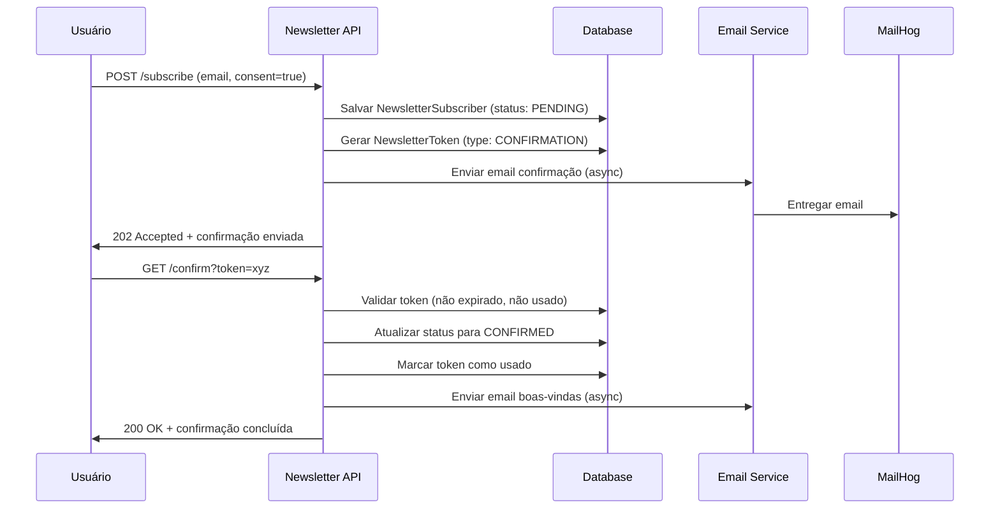

# Sistema de Newsletter - Documentação Completa

## 📋 Visão Geral

O Sistema de Newsletter é uma implementação completa e robusta para gestão de inscrições em newsletter, seguindo as melhores práticas de segurança, compliance LGPD e arquitetura enterprise.

## 🏗️ Arquitetura do Sistema

### Componentes Principais

```
Newsletter System
├── 📧 NewsletterController        # REST API endpoints
├── 🔧 NewsletterService          # Business logic principal
├── 🎫 NewsletterTokenService     # Gestão de tokens
├── 💾 NewsletterSubscriber       # Entidade principal
├── 🎟️ NewsletterToken           # Tokens de confirmação/unsubscribe
├── 📨 EmailService               # Integração de email (estendido)
├── ⏰ NewsletterTokenCleanupScheduler # Limpeza automática
└── 🧪 Testes Completos           # Unit + Integration + MailHog
```

### Fluxo de Inscrição



## 📊 Entidades do Sistema

### NewsletterSubscriber

```java
@Entity
@Table(name = "newsletter_subscribers")
public class NewsletterSubscriber {
    private Long id;
    private String email;
    private SubscriptionStatus status; // PENDING, CONFIRMED, UNSUBSCRIBED
    private LocalDateTime subscribedAt;
    private LocalDateTime confirmedAt;
    private LocalDateTime unsubscribedAt;
    
    // LGPD Compliance
    private String consentIpAddress;
    private String consentUserAgent;
    private String consentVersion;
    private Boolean consentGiven;
    private LocalDateTime consentTimestamp;
}
```

### NewsletterToken

```java
@Entity
@Table(name = "newsletter_tokens")
public class NewsletterToken {
    private Long id;
    private String token;           // UUID único
    private String email;
    private NewsletterTokenType tokenType; // CONFIRMATION, UNSUBSCRIBE, DATA_REQUEST
    private LocalDateTime createdAt;
    private LocalDateTime expiresAt;
    private LocalDateTime usedAt;
    private String ipAddress;
    private String userAgent;
}
```

## 🔐 Endpoints da API

### POST /api/v1/newsletter/subscribe
Inscreve um usuário na newsletter.

**Request:**
```json
{
  "email": "user@example.com",
  "consent": true,
  "appVersion": "1.0",
  "ipAddress": "192.168.1.1",
  "userAgent": "Mozilla/5.0..."
}
```

**Response (202 Accepted):**
```json
{
  "email": "user@example.com",
  "status": "PENDING",
  "message": "Subscription successful! Please check your email to confirm your subscription.",
  "subscribedAt": "2025-08-05T17:30:00Z"
}
```

### GET /api/v1/newsletter/confirm?token={token}
Confirma a inscrição através do token recebido por email.

**Response (200 OK):**
```json
{
  "email": "user@example.com",
  "status": "CONFIRMED",
  "message": "Email confirmed successfully! Welcome to our newsletter. You'll receive updates about new posts.",
  "confirmedAt": "2025-08-05T17:35:00Z"
}
```

### GET /api/v1/newsletter/check?email={email}
Verifica o status de inscrição de um email.

**Response (200 OK):**
```json
true  // ou false
```

## 📧 Sistema de Email

### Templates HTML Profissionais

O sistema inclui templates HTML responsivos e profissionais:

1. **Email de Confirmação**
   - Design moderno com gradientes
   - Botão CTA destacado
   - Informações de expiração (48h)
   - Link alternativo para copiar
   - Elementos de segurança (Token ID)

2. **Email de Boas-vindas**
   - Mensagem de bienvenida personalizada
   - Informações sobre o que esperar
   - Link de unsubscribe
   - Design consistente com confirmação

### Configuração de Email

```yaml
spring:
  mail:
    host: localhost      # MailHog para desenvolvimento
    port: 1025
    username: 
    password: 
    test-connection: false

blog:
  email:
    enabled: true
    from: "noreply@blogapi.com"
    base-url: "http://localhost:8080"
```

## ⚙️ Configurações do Sistema

### Token Management

```yaml
blog:
  newsletter:
    confirmation:
      token-expiration: 48h
      max-attempts-per-hour: 3
    unsubscribe:
      token-expiration: 365d
      max-attempts-per-hour: 2
    data-request:
      token-expiration: 7d
      max-attempts-per-day: 1
```

### Scheduled Cleanup

```yaml
blog:
  newsletter:
    cleanup:
      enabled: true
      expired-tokens-cron: "0 0 */6 * * *"  # A cada 6 horas
      used-tokens-cron: "0 0 2 * * *"       # Diariamente às 2h
      old-tokens-retention-days: 30
```

## ⏰ Tarefas Agendadas

### NewsletterTokenCleanupScheduler

1. **cleanupExpiredTokens()** - A cada 6 horas
   - Remove tokens expirados e não utilizados

2. **cleanupOldUsedTokens()** - Diariamente às 2h
   - Remove tokens usados há mais de 30 dias (configurável)

3. **cleanupOrphanedTokens()** - Semanalmente (domingo às 3h)
   - Remove tokens órfãos (email não existe mais)

4. **generateCleanupStatistics()** - Diariamente à 1h
   - Gera estatísticas de tokens no log

## 🧪 Testes Implementados

### Testes Unitários (8 classes)

1. **NewsletterServiceTest** - 15 testes
2. **NewsletterTokenServiceTest** - 12 testes
3. **NewsletterControllerTest** - 10 testes
4. **EmailServiceTest** - 18 testes (estendido para newsletter)
5. **NewsletterSubscriberTest** - 8 testes
6. **NewsletterTokenTest** - 6 testes
7. **NewsletterTokenRepositoryTest** - 14 testes
8. **NewsletterTokenCleanupSchedulerTest** - 6 testes

### Testes de Integração

1. **NewsletterIntegrationTest** - 10 testes
   - Fluxo completo de inscrição/confirmação
   - Validação de duplicatas
   - Tokens inválidos/expirados/usados
   - Validação de email

2. **NewsletterMailHogIntegrationTest** - 5 testes
   - Envio real de emails via MailHog
   - Validação de conteúdo HTML
   - Templates e renderização
   - Múltiplos envios

### Executar Testes

```bash
# Todos os testes de newsletter
mvn test -Dtest=Newsletter*

# Testes específicos
mvn test -Dtest=NewsletterServiceTest
mvn test -Dtest=NewsletterIntegrationTest

# Testes com MailHog (requer MailHog rodando)
docker-compose up -d mailhog
mvn test -Dtest=NewsletterMailHogIntegrationTest
```

## 🔒 Segurança e Compliance

### LGPD Compliance

- **Consentimento Explícito**: Campo obrigatório `consent=true`
- **Rastreabilidade**: IP, User-Agent, timestamp registrados
- **Versão da Política**: Controle de versões de consentimento
- **Auditoria Completa**: Logs detalhados para auditoria
- **Direito ao Esquecimento**: Possibilidade de exclusão completa

### Rate Limiting

- **Confirmação**: Máximo 3 tentativas por hora
- **Unsubscribe**: Máximo 2 tentativas por hora
- **Data Request**: Máximo 1 por dia

### Segurança de Tokens

- **UUID Seguro**: Tokens criptograficamente seguros
- **Expiração**: Diferentes tempos por tipo de token
- **Single Use**: Tokens invalidados após uso
- **Cleanup Automático**: Remoção automática de tokens expirados

## 🔍 Monitoramento e Observabilidade

### Métricas Customizadas

```java
@Timed(value = "newsletter.subscription.time")
@Timed(value = "newsletter.confirmation.process.time")
```

### Logs de Auditoria

- Todas as operações são logadas com nível INFO
- Falhas são logadas com nível WARN/ERROR
- Compliance logs incluem IP, timestamp, ação

### Health Checks

- Status do serviço de email
- Conectividade com banco de dados
- Status do Redis (cache)

## 🚀 Deploy e Configuração

### Docker Compose

O MailHog já está configurado no `docker-compose.yml`:

```yaml
mailhog:
  image: mailhog/mailhog:latest
  container_name: blog-mailhog
  ports:
    - "1025:1025"  # SMTP port
    - "8025:8025"  # Web UI port
  networks:
    - blog-network
```

### Ambiente de Desenvolvimento

```bash
# Iniciar stack completa
docker-compose up -d

# Acessar MailHog UI
http://localhost:8025

# Testar API
curl -X POST http://localhost:8080/api/v1/newsletter/subscribe \
  -H "Content-Type: application/json" \
  -d '{"email":"test@example.com","consent":true,"appVersion":"1.0"}'
```

### Ambiente de Produção

- Configurar SMTP real (SendGrid, AWS SES, etc.)
- Ajustar `blog.email.from` para email corporativo
- Configurar `blog.email.base-url` para domínio de produção
- Habilitar SSL/TLS para SMTP
- Configurar backup automático da base de dados

## 📈 Performance e Escalabilidade

### Cache Strategy

- Cache de subscribers confirmados
- Invalidação automática em mudanças de status
- TTL configurável por tipo de cache

### Processamento Assíncrono

```java
@Async("emailTaskExecutor")
public CompletableFuture<Void> sendNewsletterConfirmation(String email)
```

### Database Otimizations

- Índices em campos de busca frequente
- Consultas otimizadas com @Query
- Paginação em endpoints de listagem

## 🔧 Manutenção e Troubleshooting

### Comandos Úteis

```bash
# Ver logs do sistema
docker-compose logs -f blog-api | grep Newsletter

# Ver estatísticas de tokens
docker-compose exec postgres psql -U bloguser -d blogdb \
  -c "SELECT token_type, COUNT(*) FROM newsletter_tokens GROUP BY token_type;"

# Limpar MailHog manualmente
curl -X DELETE http://localhost:8025/api/v2/messages

# Verificar health check
curl http://localhost:8080/actuator/health
```

### Troubleshooting Comum

1. **Emails não enviados**
   - Verificar `blog.email.enabled=true`
   - Conferir configuração SMTP
   - Verificar logs do EmailService

2. **Tokens expirados**
   - Verificar configuração de `token-expiration`
   - Conferir se cleanup não está muito agressivo

3. **Duplicação de emails**
   - Verificar unique constraint no banco
   - Conferir lógica de duplicação no service

## 📚 Próximos Passos

### Melhorias Planejadas

1. **Admin Dashboard**
   - Interface para gestão de subscribers
   - Estatísticas e relatórios
   - Exportação de dados

2. **Templates Avançados**
   - Editor de templates
   - A/B testing de templates
   - Personalização por segmento

3. **Segmentação**
   - Tags e categorias
   - Envios segmentados
   - Preferências de usuário

4. **Analytics**
   - Taxa de abertura
   - Taxa de clique
   - Métricas de engagement

---

**Implementado em**: Agosto 2025  
**Versão**: 1.0  
**Autor**: AI-Driven Development  
**Stack**: Java 21 + Spring Boot 3.2 + PostgreSQL + Redis + MailHog