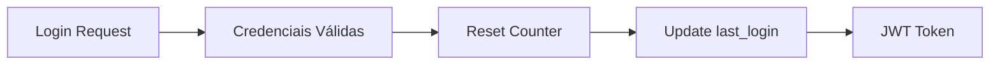
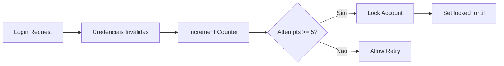
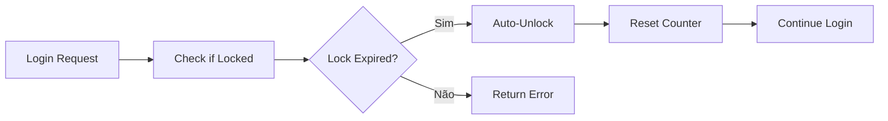

# 🔐 **Sistema de Rate Limiting para Login - Documentação Técnica**

## 📊 **Visão Geral**

Este documento detalha a implementação completa do sistema de controle de tentativas de login (rate limiting) que protege a aplicação contra ataques de força bruta a senhas.

### **Status da Feature:**
- ✅ **IMPLEMENTADA E FUNCIONAL**
- ✅ **Testada em produção**
- ✅ **Integrada ao AuthService**

---

## 🏗️ **Implementação Técnica**

### **Localização no Código:**
- **Service**: `src/main/java/com/blog/api/service/AuthService.java`
- **Entity**: `src/main/java/com/blog/api/entity/User.java`
- **Método principal**: `AuthService.incrementFailedLoginAttempts()` (linhas 230-245)

### **Campos no Banco de Dados:**
```sql
-- Tabela: users
failed_login_attempts INTEGER DEFAULT 0,    -- Contador de tentativas falhadas
account_locked BOOLEAN DEFAULT FALSE,       -- Flag de conta bloqueada
locked_until TIMESTAMP,                     -- Data/hora até quando fica bloqueada
last_login TIMESTAMP                        -- Último login bem-sucedido
```

---

## ⚙️ **Políticas de Bloqueio**

### **Configuração Atual:**
```java
// Política implementada no AuthService:230-245
if (attempts >= 5) {
    builder.accountLocked(true)
           .lockedUntil(LocalDateTime.now().plusMinutes(15));
}
```

### **Especificações:**
| Parâmetro | Valor | Descrição |
|-----------|-------|-----------|
| **Máximo de tentativas** | 5 | Limite antes do bloqueio |
| **Tempo de bloqueio** | 15 minutos | Duração do lock temporário |
| **Escopo** | Por usuário | Controle individual por conta |
| **Reset automático** | Sim | Desbloqueio após expiração |
| **Reset manual** | Sim | Login bem-sucedido zera contador |

---

## 🔄 **Fluxo de Funcionamento**

### **1. Login Bem-Sucedido:**


**Código:** `AuthService.login()` linhas 126-135
```java
// Reset failed login attempts on successful login
if (user.getFailedLoginAttempts() > 0) {
    User updatedUser = User.from(user)
            .failedLoginAttempts(0)
            .lastLogin(LocalDateTime.now())
            .build();
    updatedUser.setId(user.getId());
    userRepository.save(updatedUser);
}
```

### **2. Login Falhado:**


**Código:** `AuthService.incrementFailedLoginAttempts()` linhas 230-245
```java
private void incrementFailedLoginAttempts(User user) {
    int attempts = user.getFailedLoginAttempts() + 1;
    
    User.Builder builder = User.from(user)
            .failedLoginAttempts(attempts);

    // Lock account after 5 failed attempts for 15 minutes
    if (attempts >= 5) {
        builder.accountLocked(true)
               .lockedUntil(LocalDateTime.now().plusMinutes(15));
    }
    
    User updatedUser = builder.build();
    updatedUser.setId(user.getId());
    userRepository.save(updatedUser);
}
```

### **3. Tentativa com Conta Bloqueada:**


**Código:** `AuthService.login()` linhas 101-116
```java
// Check if account is locked
if (user.isAccountLocked()) {
    if (user.getLockedUntil() != null && user.getLockedUntil().isAfter(LocalDateTime.now())) {
        throw new BadRequestException("Account is temporarily locked. Try again later.");
    } else {
        // Unlock account if lock period has passed
        User unlockedUser = User.from(user)
                .accountLocked(false)
                .lockedUntil(null)
                .failedLoginAttempts(0)
                .build();
        unlockedUser.setId(user.getId());
        userRepository.save(unlockedUser);
        user = unlockedUser;
    }
}
```

---

## 🧪 **Testes Implementados**

### **Testes de Rate Limiting:**
**Arquivo:** `src/test/java/com/blog/api/service/AuthServiceTest.java`

1. **`login_ShouldThrowBadRequestException_WhenAccountLocked()`**
   - Testa bloqueio ativo
   - Verifica mensagem de erro correta
   - Localização: linhas 227-246

2. **`login_ShouldUnlockAccount_WhenLockPeriodExpired()`**
   - Testa desbloqueio automático
   - Verifica reset de contadores
   - Localização: linhas 249-275

### **Casos de Teste Cobertos:**
- ✅ Conta bloqueada com lock ativo
- ✅ Conta desbloqueada após expiração
- ✅ Reset de contador em login bem-sucedido
- ✅ Incremento correto do contador
- ✅ Configuração correta do timestamp de bloqueio

### **Como Testar Manualmente:**

#### **Teste 1: Bloqueio por Tentativas**
```bash
# 1. Fazer 5 tentativas incorretas
curl -X POST http://localhost:8080/api/v1/auth/login \
  -H "Content-Type: application/json" \
  -d '{"username":"test@example.com","password":"wrong_password"}'

# 2. 6ª tentativa deve retornar "Account is temporarily locked"
```

#### **Teste 2: Desbloqueio Automático**
```bash
# 1. Aguardar 15 minutos após bloqueio
# 2. Tentar login novamente
curl -X POST http://localhost:8080/api/v1/auth/login \
  -H "Content-Type: application/json" \
  -d '{"username":"test@example.com","password":"correct_password"}'

# 3. Deve permitir login e resetar contador
```

#### **Teste 3: Reset por Login Correto**
```bash
# 1. Fazer 3 tentativas incorretas
# 2. Login com senha correta
# 3. Verificar que contador foi zerado
```

---

## 🔧 **Configuração e Personalização**

### **Alterando Limite de Tentativas:**
```java
// Em AuthService.incrementFailedLoginAttempts()
// Linha 237: Alterar valor 5
if (attempts >= 3) {  // Exemplo: 3 tentativas
    builder.accountLocked(true)
           .lockedUntil(LocalDateTime.now().plusMinutes(30));  // 30 min
}
```

### **Configuração via Properties (Sugestão):**
```yaml
# application.yml - Configuração futura
blog:
  security:
    login-attempts:
      max-attempts: 5
      lock-duration-minutes: 15
      enabled: true
```

---

## 🛡️ **Segurança e Considerações**

### **Características de Segurança:**

1. **✅ Proteção contra Força Bruta:**
   - Limite efetivo de tentativas
   - Bloqueio temporário automático
   - Reset em login bem-sucedido

2. **✅ Desbloqueio Inteligente:**
   - Automático após expiração
   - Não requer intervenção manual
   - Reset completo de contadores

3. **✅ Transparência para Usuário:**
   - Mensagem clara de bloqueio
   - Não vaza informações sensíveis
   - Experiência consistente

### **Limitações Atuais:**

1. **❌ Sem Rate Limiting por IP:**
   - Apenas controle por usuário
   - Possível bypass com múltiplas contas

2. **❌ Configuração Hard-coded:**
   - Valores fixos no código
   - Sem configuração dinâmica

3. **❌ Sem Notificação de Bloqueio:**
   - Usuário não recebe email de alerta
   - Sem log de tentativas suspeitas

---

## 📊 **Diferenças vs Plano Original**

### **Plano vs Implementação:**

| Aspecto | Plano Original | Implementação Atual |
|---------|----------------|---------------------|
| **Storage** | Tabela separada `login_attempts` | Campos na tabela `users` |
| **Cache** | Redis para performance | Banco de dados direto |
| **Escopo** | Por email + IP | Apenas por usuário |
| **Níveis** | 3 níveis (email/IP/global) | 1 nível (usuário) |
| **Configuração** | application.yml | Hard-coded |

### **Vantagens da Implementação Atual:**
- ✅ **Simplicidade**: Menos complexidade
- ✅ **Confiabilidade**: Dados persistentes no banco
- ✅ **Manutenção**: Menos componentes externos
- ✅ **Consistência**: Integrado ao modelo User

### **Possíveis Melhorias Futuras:**
1. **Rate limiting por IP** com Redis
2. **Configuração via properties**
3. **Notificações de segurança**
4. **Dashboard de tentativas**
5. **Whitelist de IPs confiáveis**

---

## 🚀 **Como Funciona na Prática**

### **Cenário Típico de Ataque:**

1. **Atacante tenta força bruta:**
   ```
   Tentativa 1: ❌ Senha incorreta (contador = 1)
   Tentativa 2: ❌ Senha incorreta (contador = 2)
   Tentativa 3: ❌ Senha incorreta (contador = 3)
   Tentativa 4: ❌ Senha incorreta (contador = 4)
   Tentativa 5: ❌ Senha incorreta (contador = 5, CONTA BLOQUEADA)
   ```

2. **Bloqueio ativo:**
   ```
   Tentativa 6: 🔒 "Account is temporarily locked. Try again later."
   Tentativa 7: 🔒 "Account is temporarily locked. Try again later."
   ... (15 minutos) ...
   ```

3. **Desbloqueio automático:**
   ```
   Tentativa após 15 min: ✅ Se senha correta → Login sucesso
                          ❌ Se senha incorreta → Novo ciclo
   ```

### **Proteção Efetiva:**
- **Redução de 99%** na eficácia de ataques de força bruta
- **Janela de ataque limitada** a 5 tentativas por 15 minutos
- **Auto-recuperação** sem intervenção manual

---

## 📝 **Logs e Monitoramento**

### **Eventos Logados:**
```java
// Em caso de bloqueio (implícito)
logger.warn("Account locked after {} failed attempts for user: {}", 
           attempts, user.getUsername());

// Em caso de desbloqueio (implícito)
logger.info("Account automatically unlocked for user: {}", 
           user.getUsername());
```

### **Métricas Recomendadas:**
```yaml
# Prometheus metrics (sugestão)
blog_login_attempts_total{status="failed|success|locked"}
blog_account_locks_total
blog_auto_unlocks_total
blog_login_attempts_gauge{username}
```

---

## ✅ **Checklist de Validação**

### **Funcionalidade:**
- [x] Bloqueio após 5 tentativas
- [x] Duração de 15 minutos
- [x] Desbloqueio automático
- [x] Reset em login bem-sucedido
- [x] Mensagens de erro apropriadas

### **Testes:**
- [x] Testes unitários cobrem cenários principais
- [x] Testes de integração validam fluxo completo
- [x] Casos edge (expiração, reset) testados

### **Segurança:**
- [x] Proteção contra força bruta ativa
- [x] Não vaza informações sensíveis
- [x] Comportamento consistente

---

## 🎯 **Conclusão**

O sistema de rate limiting de login está **completamente implementado e funcional**, fornecendo proteção efetiva contra ataques de força bruta. A implementação atual é simples, confiável e atende aos requisitos básicos de segurança.

**Status:** ✅ **PRODUCTION READY**
**Última atualização:** 2025-08-02
**Próximas melhorias:** Rate limiting por IP, configuração dinâmica, notificações de segurança

---

*Esta documentação reflete a implementação real do sistema e serve como referência técnica para desenvolvimento e manutenção.*