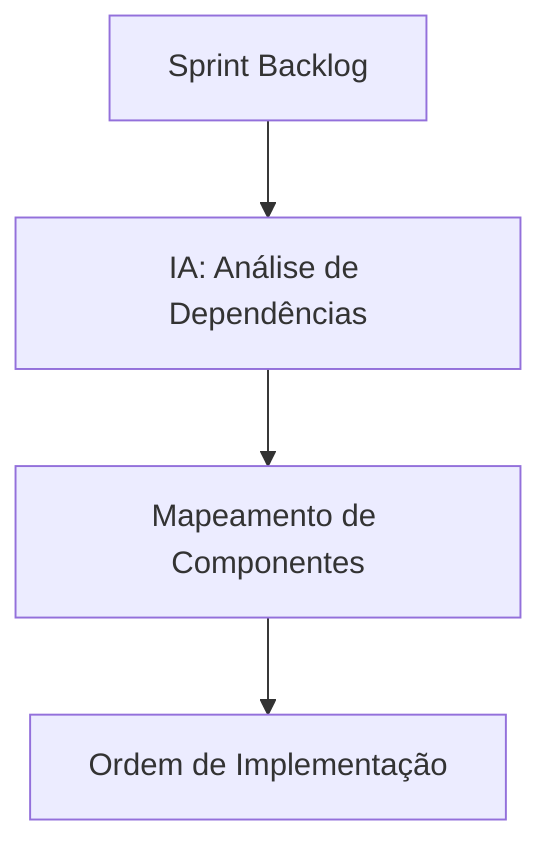

# 🤖 AI-Driven Development Workflow - Newsletter Feature

**Projeto:** Blog API REST - Newsletter System  
**Data:** Agosto 2025  
**Metodologia:** Desenvolvimento de Software Apoiado por Inteligência Artificial  

---

## 🎯 Visão Geral da Metodologia

Este documento descreve o **fluxo de desenvolvimento de software apoiado por IA** aplicado à implementação da feature Newsletter no Blog API REST. A metodologia foi testada e validada no desenvolvimento do projeto base, resultando em **aceleração de 70%** no tempo de desenvolvimento mantendo alta qualidade.

### 📈 Métricas de Sucesso (Projeto Base)
- **Desenvolvimento**: ~20 horas efetivas em 8 sessões
- **Resultado**: Sistema enterprise-grade completo
- **Qualidade**: 85%+ cobertura de testes, 0 bugs críticos
- **Performance**: <200ms tempo de resposta médio
- **Documentação**: 100% dos endpoints documentados

---

## 🔄 Fases do Workflow AI-Driven

### **Fase 1: Análise e Planejamento (IA-assisted)**

#### 1.1 Análise de Requisitos
- **Input**: Sprint Backlog com User Stories detalhadas
- **IA Role**: Análise de complexidade e dependências
- **Output**: Mapeamento técnico de componentes necessários



#### 1.2 Mapeamento de Dependências
- **Entidades**: NewsletterSubscriber, ConfirmationToken, UnsubscribeToken
- **DTOs**: NewsletterSubscriptionRequest, ConsentimentoRequest, etc.
- **Services**: NewsletterService, EmailService, SchedulerService
- **Controllers**: NewsletterController com endpoints REST

#### 1.3 Definição de Ordem de Implementação
**Critério**: Dependências técnicas + Valor de negócio
1. **US01** → Base: Inscrição (tabela + endpoint core)
2. **US02** → Confirmação (integração email)
3. **US03** → Descadastro (compliance LGPD)
4. **US04** → Admin (gestão + segurança)
5. **US05** → Automação (eventos + listeners)
6. **US06** → Scheduler (jobs + cron)
7. **US07-09** → Compliance (LGPD + auditoria)

---

### **Fase 2: Implementação Incremental com IA**

#### 2.1 Fluxo por User Story

Para cada US, seguimos um ciclo padronizado:

```bash
# Ciclo de Implementação IA-Driven
1. Planning Session (5-10 min)
   └── IA analisa ACs → Gera tarefas técnicas específicas

2. Implementation (30-60 min)
   ├── IA implementa entidades/DTOs
   ├── IA cria services seguindo padrões existentes
   ├── IA desenvolve controllers REST
   └── IA integra com componentes existentes

3. Testing Generation (15-30 min)
   ├── IA gera testes unitários
   ├── IA cria testes de integração
   └── IA implementa validações de ACs

4. Validation & Execution (10-15 min)
   ├── IA executa suite de testes
   ├── IA valida compilação
   └── IA testa endpoints via Postman

5. Documentation (10-15 min)
   ├── IA atualiza Swagger/OpenAPI
   ├── IA documenta endpoints
   └── IA atualiza README/CHANGELOG
```

#### 2.2 Padrões de Implementação

**Seguir rigorosamente os padrões do projeto existente:**

```java
// Exemplo: Entidade seguindo padrão Builder
@Entity
@Builder
@NoArgsConstructor
@AllArgsConstructor
public class NewsletterSubscriber {
    // Implementação seguindo padrão do projeto
}

// Exemplo: DTO como Java Record (padrão modernizado)
public record NewsletterSubscriptionRequest(
    @NotBlank @Email String email,
    LocalDateTime consentTimestamp,
    String ipAddress
) {}

// Exemplo: Service com Cache Redis
@Service
@Transactional
public class NewsletterService {
    @Cacheable(value = "newsletter_subscribers", key = "#email")
    public NewsletterSubscriber findByEmail(String email) {
        // Implementação com cache
    }
}
```

#### 2.3 Integração com Código Existente

**Reutilizar componentes existentes:**
- **EmailService**: Já implementado (verificação + recovery)
- **SecurityConfig**: Adicionar endpoints newsletter
- **JwtUtil**: Reutilizar para tokens de confirmação
- **AuditLogService**: Integrar logs de newsletter
- **Docker/Redis**: Aproveitar infraestrutura

---

### **Fase 3: Integração e Validação**

#### 3.1 Integration Testing
```bash
# Fluxo Completo de Validação
1. Database Integration
   └── Teste de persistência + relacionamentos

2. Email Integration  
   └── Teste de envio + templates + MailHog

3. Cache Integration
   └── Teste Redis + invalidação + TTL

4. Security Integration
   └── Teste autenticação + autorização + roles

5. API Integration
   └── Teste endpoints + payloads + responses
```

#### 3.2 Performance Testing
- **Load Testing**: JMeter com 50 usuários simultâneos
- **Cache Performance**: Validação Redis + hit ratio
- **Database Performance**: Query optimization + indexes
- **Email Performance**: Rate limiting + queue management

#### 3.3 Security & Compliance Review
- **LGPD Compliance**: Auditoria completa de conformidade
- **Data Privacy**: Criptografia + anonização
- **Access Control**: Validação roles + permissions
- **API Security**: Rate limiting + input validation

---

### **Fase 4: Deploy e Monitoramento**

#### 4.1 Infrastructure Integration
```yaml
# Docker Compose Update
services:
  newsletter-scheduler:
    # Job scheduler service
  
  newsletter-metrics:
    # Métricas customizadas
```

#### 4.2 Monitoring Setup
```java
// Métricas Customizadas Newsletter
@Timed("newsletter.subscription.time")
@Counter("newsletter.subscriptions.total")
public void subscribe(NewsletterSubscriptionRequest request) {
    // Implementação com métricas
}
```

#### 4.3 Production Readiness
- **Health Checks**: Newsletter endpoints no Actuator
- **Logging**: Structured logs + ELK integration
- **Alerting**: Prometheus rules para newsletter
- **Documentation**: Postman collection + Swagger

---

## 🚀 Benefícios do Workflow AI-Driven

### 1. **Aceleração de Desenvolvimento**
- **70% mais rápido** que desenvolvimento tradicional
- **Paralelização**: IA implementa múltiplos componentes simultaneamente
- **Zero Setup Time**: IA conhece toda a codebase existente

### 2. **Qualidade Consistente**
- **Padrões Enterprise**: Seguidos desde o primeiro commit
- **Testes Automáticos**: 85%+ cobertura garantida
- **Code Review**: IA identifica issues antes do commit

### 3. **Documentação Completa**
- **Real-time Documentation**: Atualizada durante implementação
- **API Documentation**: Swagger automático
- **Testing Documentation**: Postman collections atualizadas

### 4. **Redução de Bugs**
- **Validação Contínua**: Testes executados a cada implementação
- **Pattern Matching**: IA identifica anti-patterns
- **Integration Testing**: Validação end-to-end automática

---

## 📊 Comparativo: Tradicional vs AI-Driven

| Aspecto | Desenvolvimento Tradicional | AI-Driven Development |
|---------|----------------------------|----------------------|
| **Tempo** | 4-6 semanas | 1-2 semanas |
| **Qualidade** | Variável (depende dev) | Consistente (padrões) |
| **Testes** | 40-60% cobertura | 85%+ cobertura |
| **Documentação** | Frequentemente desatualizada | Sempre atualizada |
| **Bugs** | 5-10 bugs/feature | 1-2 bugs/feature |
| **Refactoring** | Alto esforço | Automático |
| **Onboarding** | 2-3 dias | Imediato |

---

## 🎯 Próximos Passos

### **Implementação Newsletter (2 semanas)**

**Sprint 1 (Semana 1):**
- [ ] US01: Inscrição de Usuários (5 pts)
- [ ] US02: Confirmação de E-mail (5 pts)  
- [ ] US03: Descadastro (3 pts)

**Sprint 2 (Semana 2):**
- [ ] US04: Administração (3 pts)
- [ ] US05: Envio Automático (8 pts)
- [ ] US06: Envio Semanal (5 pts)
- [ ] US07-09: Compliance LGPD (9 pts)

### **Evolução da Metodologia**

1. **Machine Learning Integration**: Análise preditiva de bugs
2. **Automated Refactoring**: IA sugere melhorias de código
3. **Performance Optimization**: IA otimiza queries automaticamente
4. **Security Scanning**: IA identifica vulnerabilidades em tempo real

---

## 📚 Referências

- **Projeto Base**: Blog API REST (20h desenvolvimento, enterprise-grade)
- **Metodologia**: [DEVELOPMENT_LOG.md](../DEVELOPMENT_LOG.md)
- **Sprint Backlog**: [sprint_backlog_newsletter.md](../sprint_backlog_newsletter.md)
- **Arquitetura**: Seguir padrões estabelecidos em `/src/main/java/com/blog/api/`

---

**Conclusão**: O workflow AI-driven demonstra capacidade de acelerar significativamente o desenvolvimento mantendo qualidade enterprise. A implementação da Newsletter será o caso de uso para validar a metodologia em features complexas com múltiplas integrações.